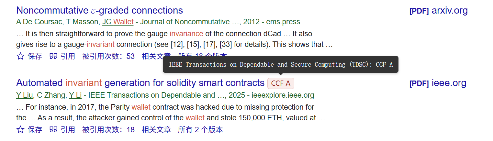

<h1 align="center"> CCFrank</h1>

    
    
    
    
    
    
    

The Chrome Extension, Firefox and Edge Add-on display the China Computer Federation recommended rank of international
conferences and journals in the dblp, Google Scholar, Connected Papers, Semantic Scholar and Web of Science search results.

Chrome 扩展程序、Firefox 和 Edge 附加组件，在 dblp、Google 学术、Connected Papers、Semantic Scholar 和 Web of Science 的搜索结果中显示中国计算机学会推荐的国际会议和期刊排名。

2025.12

* 简单的ui更新，更加柔和
* 不再显示ccf none
* bug fixes （在 dataGen.js 第 245 行，/conf/sigsoft 和 /conf/sigsoft/fse 之间错误地使用了空格而不是制表符）

